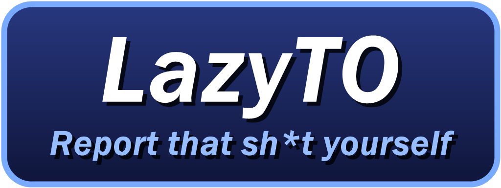
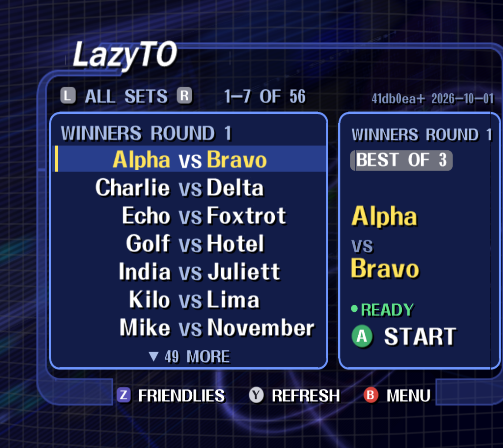
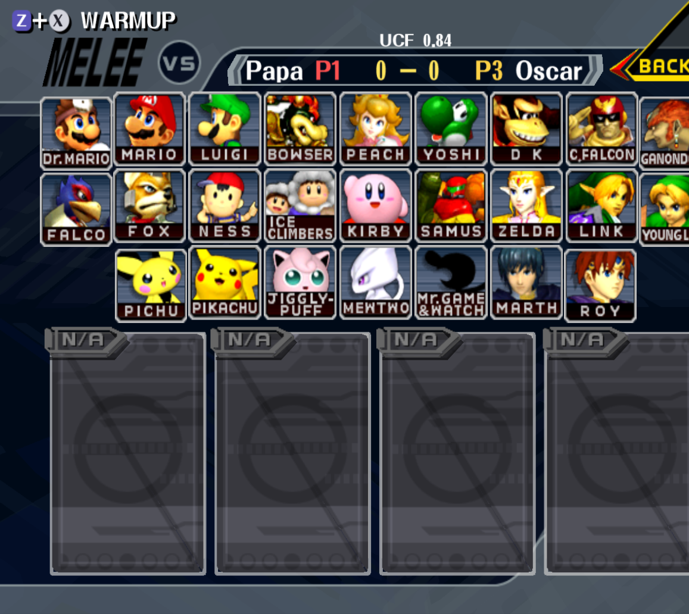
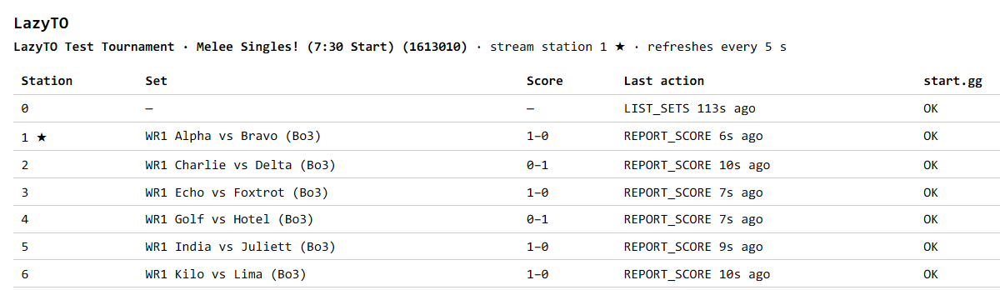

LazyTO lets players at a Melee tournament run their own start.gg sets from the Wii. They pick
their set from a list on the console, play, and each game's result reaches start.gg as the game
ends. The TO steps in only when something goes wrong.

**Status: beta in preparation.** It runs end to end in development and has booted on a real Wii.
It has not run a full night at a venue yet.

## Quick start

1. **Get LazyTO.** Clone this repo with `git clone --recursive` on a PC with Node 22, and run
   `npm ci`. Releases will appear on [GitHub Releases](https://github.com/PranavMin/LazyTO/releases)
   from the first `v*` tag. Until then, build `tournament.bin` from source as described in
   [docs/development.md](docs/development.md).
2. **Set up the Pi.** Flash Raspberry Pi OS, fill in `.env` with your start.gg token, secret,
   tournament, event and stream, then run `npm run push -- --test` against a test tournament.
   When it works, `npm run push` goes live. See [docs/pi-setup.md](docs/pi-setup.md).
3. **Prepare each Wii's SD card.** With the card in the PC, run
   `npm run sync-card -- --station N` (add `--stream 1` on the stream Wii). It needs the GitHub
   CLI `gh`, logged in, to fetch the loader, and `--module <file>` if your `tournament.bin` is not
   at `kiosk/build/tournament.bin`. Then copy your own
   Melee 1.02 image to `games/GALE01/game.iso`. See [docs/wii-setup.md](docs/wii-setup.md).
4. **Run the night.** Power on the Pi, start every pool on start.gg, boot the Wiis and watch
   the status page at http://relay.local:29473. See [docs/night-of.md](docs/night-of.md).

## How it works

- **The Wiis** run a stock Melee 1.02 image through the LazyTO loader, a build of Slippi
  Nintendont. At boot the loader copies a small kiosk module, `tournament.bin`, from the SD card
  into the game. The module adds the set list, the score banner on the character select screen,
  and automatic scoring. Your venue's usual Slippi settings and codes (UCF, stage striking and so
  on) keep working.
- **The relay** runs on a Raspberry Pi on the venue network. The Wiis find it on their own, send
  it each button press, and it makes the matching start.gg call: start the set, put it on stream,
  report each game, end the set.
- **start.gg stays the source of truth.** Anything the relay can't do, the TO does on start.gg
  as usual. A stream overlay that reads start.gg keeps working unchanged.

## Screenshots

The set list a Wii shows at boot: pick your set and press A to start it on start.gg.

Character select during a set: the banner shows both players, their ports and the score.

The relay's status page during a test run: each station's set, score and last start.gg call.

## What you need

- A Raspberry Pi (a Pi 5, or any Pi that runs 64-bit or 32-bit Raspberry Pi OS) and a PC with Node 22 (Windows, macOS or Linux)
  to set it up from.
- On that PC, the GitHub CLI ([`gh`](https://cli.github.com/)), logged in with `gh auth login`.
  `npm run sync-card` uses it to download the Wii loader.
- Wiis with the Homebrew Channel, one SD card each, and a stock NTSC 1.02 Melee image.
- A Wi-Fi network the Wiis and the Pi share, where devices can reach each other. Guest networks
  often block that.
- A start.gg account that is an admin of your tournament, and a start.gg API token for it.

## Guides

| Guide | For |
|---|---|
| [docs/pi-setup.md](docs/pi-setup.md) | Setting up the relay on a Pi, and the relay's settings |
| [docs/wii-setup.md](docs/wii-setup.md) | Preparing SD cards and Wiis |
| [docs/night-of.md](docs/night-of.md) | Running a tournament: the checklist, the status page, and troubleshooting |
| [docs/development.md](docs/development.md) | Building and testing LazyTO from source |
| [docs/architecture.md](docs/architecture.md) | How it works inside |
| [docs/decisions.md](docs/decisions.md) | Why it works that way |

## Repositories

The kiosk's source is in [kiosk/](kiosk/). It builds against the unmodified Melee decompilation, a git submodule at `melee/`. The loader is the Nintendont fork, a submodule at `Nintendont/`. Clone with `git clone --recursive`.

| Repo | What it builds |
|---|---|
| **LazyTO** (this repo) | The relay, the kiosk module `tournament.bin`, the Wii-to-relay protocol ([protocol.yaml](protocol.yaml)), the deploy scripts and the docs |
| [doldecomp/melee](https://github.com/doldecomp/melee) | The Melee decompilation, unmodified. The kiosk builds against its headers, compilers and symbol map. |
| [Nintendont](https://github.com/PranavMin/Nintendont) | The LazyTO loader for the Wii |

## Licence

Copyright (C) 2026 Kegstand Jesus (PranavMin). LazyTO is free software under the GNU General Public License, version 2: see [LICENSE](LICENSE). The LazyTO loader is a fork of Slippi Nintendont and stays under its GPLv2.

### Nintendo and Melee

LazyTO ships no Nintendo code, no game images and no game assets. You supply your own legally
obtained NTSC 1.02 Melee image. The kiosk module builds against the headers and symbol map of the
community Melee decompilation and calls the game's own functions in your copy. Its graphics, such
as the LazyTO wordmark, are generated by scripts in [kiosk/tools/](kiosk/tools/).

LazyTO is not affiliated with or endorsed by Nintendo, start.gg or Project Slippi. Super Smash Bros.
Melee, Nintendo and Wii are trademarks of Nintendo.
